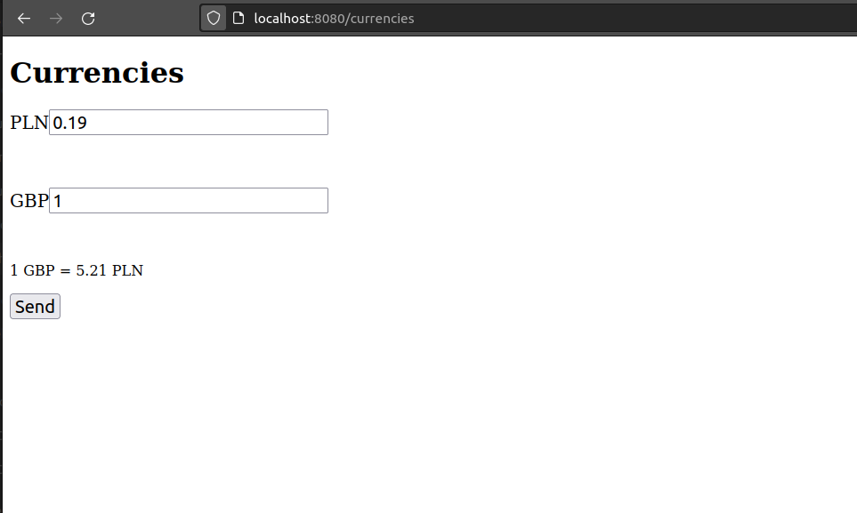
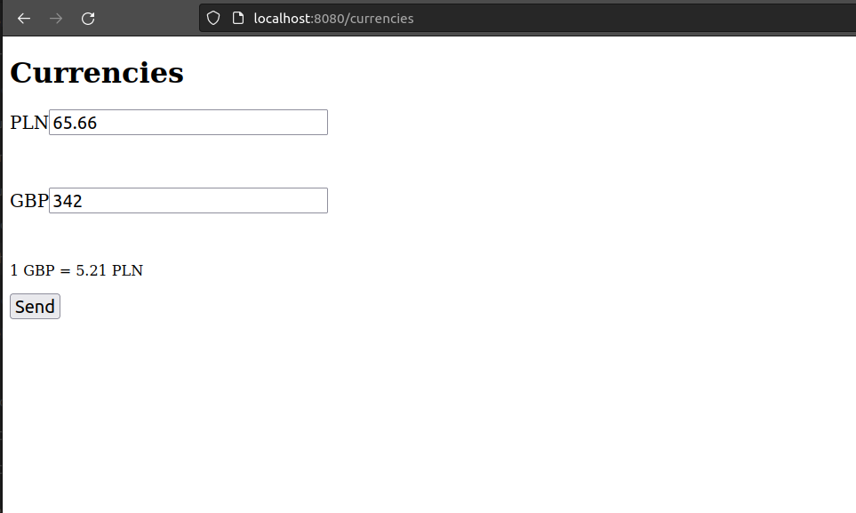
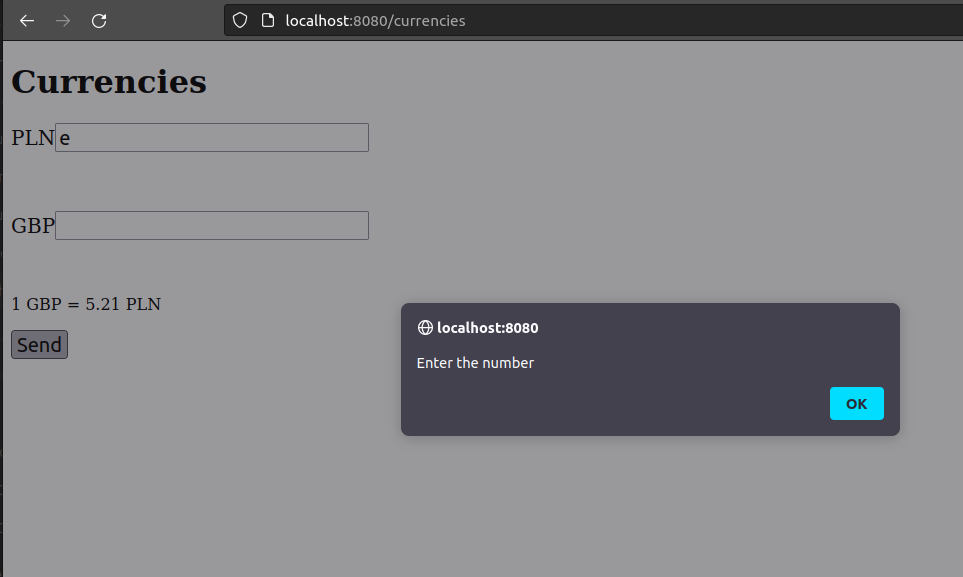

# CurrenciesWebApp

Simple web application to change currencies with actual data from http://api.nbp.pl/.
Application is based on spring boot

To download
------------
	git clone https://github.com/OpalinskiJakub/CurrenciesWebApp.git

To start
------------
	mvn spring-boot:run

To run tests
------------
	mvn test

Application works on http://localhost:8080/currencies

The application is protected against bad data
------------

